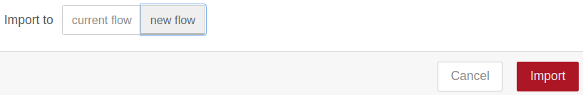
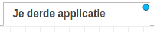

# Bijlage

!!! info
    Zorg ervoor dat je toestemming hebt van een ouder of verantwoordelijke volwassene voordat je iets downloadt op je computer. Als je hulp nodig hebt tijdens het downloaden en installeren, vraag dan aan een ouder of verantwoordelijke volwassene om je te helpen.

## Importeren van de code van alle hoofdstukken vanaf les 5

Importeer de de volgende code via het Menu/Import.

|Stap        | Actie      |
|:---------- | :---------- |
| 1 | Klik op de link uit de [List applicaties](#Lijst-applicaties) van de code die je wilt importeren. |
| 2 | Druk op: Ctrl+A om alle code te selecteren/verlichten. |
| 3 | Kopieer de code naar het klembord, druk op: Ctrl+C. |
| 4 | Open de node-editor: <IP raspberry pi>:1880 |
| 5 | Activeer het menu en kies voor Import of druk op Ctrl+I. ``\\`` |
| 7 | Plak de code in het vlak waar de cursor staat: Ctrl+V. |
| 6 | Selecteer: new flow. ``\\`` |
| 8 | Druk op de rode toets Import. |
| 8 | Er verschijnt een niewe tab met de knooppunten erin. ``\\`` |
| 9 | Druk op: Deploy. |
||

!!! info "Verwijderen van een tab"
    Klik met je rechtermuistoets op een tab en kies Delete uit het menu.

## Lijst applicaties
- [Je eerste applicatie: een website opzetten.](assets/eerste.json)
- [Je tweede applicatie: Plaatjes van Honden tonen.](assets/tweede.json)
- [Je derde applicatie: Vuurpijl afschieten.](assets/derde.json)
- [Een Vuurpijl activeren vanuit je smartphone.](assets/smartphone.json). Eerst de [module Dashboard](..//chapter8/index.html#Stap-1-De-Node-RED-Dashboard-module-downloaden.) installeren!

## Foutmelding bij wijzigen WiFi gegevens

Ik kreeg  de volgende foutmelding bij het wijzigen van de wifi gegevens: an error running option s1 wireless lan.

Probeer de netwerkgegevens te veranderen met: `sudo nano /etc/wpa_supplicant/wpa_supplicant.conf`.

Zie voor meer [info](https://forums.raspberrypi.com/viewtopic.php?t=313637).