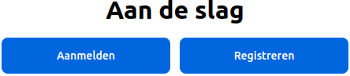
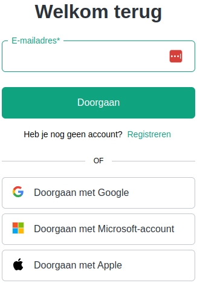
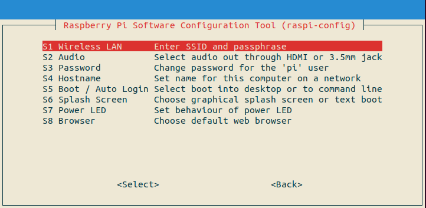

# Bijlage

!!! info
    Zorg ervoor dat je toestemming hebt van een ouder of verantwoordelijke volwassene voordat je iets downloadt op je computer. Als je hulp nodig hebt tijdens het downloaden en installeren, vraag dan aan een ouder of verantwoordelijke volwassene om je te helpen.

## Account aanmaken bij ChatGPT

Om een account aan te maken voor ChatGPT bij OpenAI, kun je de volgende stappen volgen:

1. Open je webbrowser en ga naar [OpenAI](https://chatgpt.com/auth/login) en klik op de toets **Registreren** . ``\\``.
2. Klik op de link **Registreren** of maak een keuze voor één van de accounts uit de lijst daaronder als je die al hebt. ``\\``: 
3. Vul je gegevens in. Je wordt gevraagd om enkele persoonlijke gegevens in te vullen, zoals je naam, e-mailadres en een wachtwoord. Zorg ervoor dat je een geldig e-mailadres gebruikt, want je zult een bevestigingsmail ontvangen.
4. Verifieer je e-mailadres. Na het invullen van je gegevens en het indienen van het formulier, ontvang je een e-mail van OpenAI met een link om je e-mailadres te verifiëren. Klik op deze link om je registratie te voltooien.
5. Log in op je account: Na verificatie kun je teruggaan naar de OpenAI-website en inloggen met je nieuwe accountgegevens.

## Importeren van de code van alle hoofdstukken vanaf les 5

Importeer de de volgende code via het Menu/Import.

|Stap        | Actie      |
|:---------- | :---------- |
| 1 | Klik op de link uit de [List applicaties](#Lijst-applicaties) van de code die je wilt importeren. |
| 2 | Druk op: Ctrl+A om alle code te selecteren/verlichten. |
| 3 | Kopieer de code naar het klembord, druk op: Ctrl+C. |
| 4 | Open de node-editor: <IP raspberry pi>:1880 |
| 5 | Activeer het menu en kies voor Import of druk op Ctrl+I. ``\\`` |
| 7 | Plak de code in het vlak waar de cursor staat: Ctrl+V. |
| 6 | Selecteer: new flow. ``\\`` |
| 8 | Druk op de rode toets Import. |
| 8 | Er verschijnt een niewe tab met de knooppunten erin. ``\\`` |
| 9 | Druk op: Deploy. |
||

!!! info "Verwijderen van een tab"
    Klik met je rechtermuistoets op een tab en kies Delete uit het menu.

## Lijst applicaties
- [Je eerste applicatie: een website opzetten.](assets/eerste.json)
- [Je tweede applicatie: Plaatjes van Honden tonen.](assets/tweede.json)
- [Je derde applicatie: Vuurpijl afschieten.](assets/derde.json)
- [Een Vuurpijl activeren vanuit je smartphone.](assets/smartphone.json). Eerst de [module Dashboard](chapter8/index.html#Stap-1-De-Node-RED-Dashboard-module-downloaden.) installeren!

## Foutmelding bij wijzigen WiFi gegevens

Ik kreeg de volgende foutmelding bij het wijzigen van de wifi gegevens met `sudo raspi_config -> System Options: an error running option s1 wireless lan.

Probeer de netwerkgegevens te veranderen met: `sudo nano /etc/wpa_supplicant/wpa_supplicant.conf`.

Klik voor meer informatie op: [info](https://forums.raspberrypi.com/viewtopic.php?t=313637).

## Veranderen wachtwoord via de terminal

1. Open een terminal en ga naar: ssh pi@raspi-1.
2. Typ: passwd.
3. Typ: oude password.
4. Typ: nieuwe password.
5. Typ: nieuwe password opnieuw.

