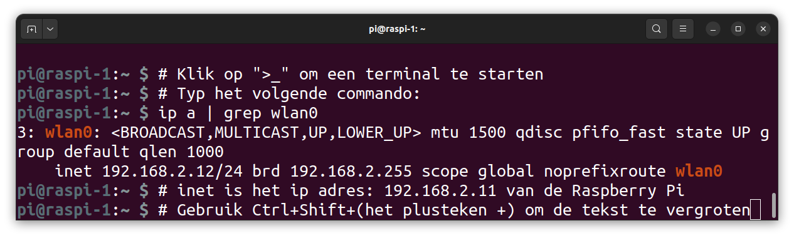
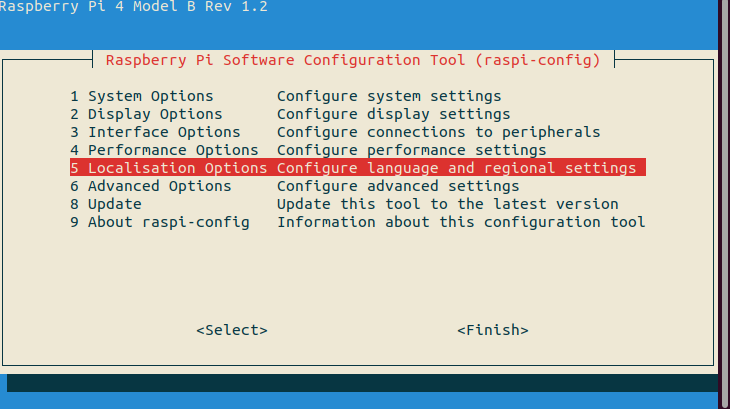
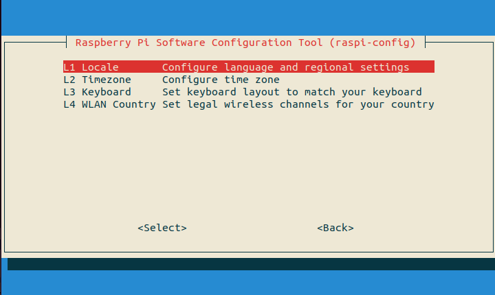
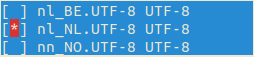
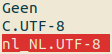
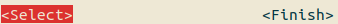
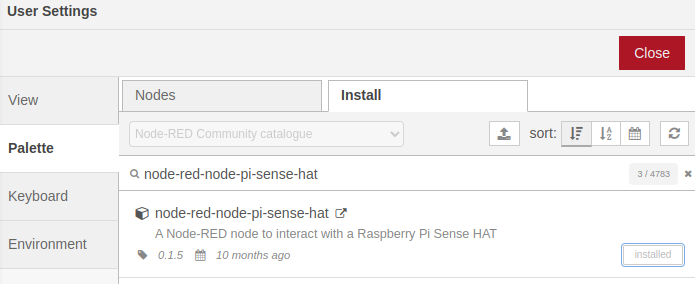
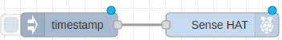
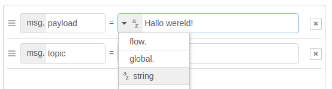

# Blog

## 2024

### 10/06/2024 - Eerste twee applicaties werken niet meer goed!

**LET OP!**
In de laatste CoderDojo merkte ik dat de eerste twee opdrachten niet meer goed werken, omdat Http-in een Http-request in de laatste versie 3.1.9 van Node-RED zijn aangepast. Ik moet de opdrachten gaan aanpassen en laat weten wanneer ze veranderd zijn.

### 07/06/2024 - IP adres Raspberry Pi tonen bij de CoderDojo sessie van het Techlab

Zorg ervoor dat er een toetsenbord, muis en HDMI-scherm op de Raspberry Pi zijn aangesloten. Zorg ervoor dat je bent verbonden met het wifi-netwerk van TechLab. Standaard is dit netwerk al voor je ingesteld.

Zoek naar een zwart vlakje met ">_" op je scherm. Klik met de muis op dit vlakje om een teminal te openen. Vergroot het venster door met je muis op "^"-symbool in de titelbalk te klikken.

Het ip adres van de Raspberry Pi toon je als volgt:
 



### 05/06/2024 - Locale instelling wijzigen

Als je nu het commando "locale" typt, dan laat je computer zien in welke taal hij praat en hoe hij andere dingen instelt. Net zoals je thuis misschien de taal van je tv of spelcomputer kunt aanpassen, kun je dat ook met je computer doen, zie ook [Raspberry Pi Forum](https://forums.raspberrypi.com/viewtopic.php?t=253136):

```
locale # toon instellingen
sudo apt update # lijst bijwerken
sudo apt install locales-all # alle talen installeren
sudo raspi-config
# Voer de stappen uit onder "Volg deze stappen:".
# Let goed op, lees de stappen eerst aandachtig door en volg ze precies
# zoals ze beschreven staan.
```
**Volg deze stappen:**

|Stap        | Actie      |
|:---------- | :---------- |
| 1 | Nu de instellingen aanpassen, kies eerste voor (met pijl-naar-beneden-toets en Enter): 5. Localisation Options  ``\\``|
| 2 | Kies voor: L1. Locale. Druk op de Enter-toets. ``\\`` |
| 3 | Markeer met de spatiebalk `nl_NL.UTF-8` in de lijst. ``\\``  |
| 4 | Druk op de Tab-toets. <Ok> is nu verlicht. Druk op de Enter-toets. |
| 5 | `nl_NL.UTF-8` staat al verlicht. ``\\`` |
| 6 | Druk op de Tab-toets. <Ok> is nu verlicht. Druk op de Enter-toets. |
| 7 | Druk op de Tab-toets om het menu te verlaten. <Select> staat nu verlicht. ``\\`` |
| 8 | Druk op de pijl-naar-rechts-toets. <Finish> is nu verlicht. |
| 9 | Druk op de Enter-toets. Je bent terug bij de prompt. |
| 10 | Herstart je Raspberry Pi om de wijzigingen te bewaren met: `sudo reboot`. |

### 26-5-2024 - UCTRONICS HDMI display

Ik gebruik een 7-inch HDMI 1024x600 LCD display met capacitieve multi-touch touchscreen van [UCtronics](https://www.sossolutions.nl/uctronics-7-inch-ips-touchscreen-for-raspberry-pi-with-prop-stand-1024-600-capacitive-hdmi-lcd-monitor-portable-display-for-raspberry-pi-4-3-b-windows-10-8-7-free-driver?gad_source=1&gclid=Cj0KCQjw3tCyBhDBARIsAEY0XNlMsYe0sFoa4RbZ23QPJDhGwW9soGrXK5luyFV-TT80C5EnAl_Sas0aAk5lEALw_wcB). Voor de SENSEHATKIDS CoderDojo cursus gebruik ik het om het IP-adres van de Raspberry Pi 4 te achterhalen met: `ip a | grep wlan0`, omdat niet ieder netwerk namen (zoals: raspi-1) van servers ondersteunt. De Desktop versie laat namelijk alle SSID endpoints zien in een omgeving. Om het display geschikt te maken zijn er wat aanpassingen nodig. Installeer wel de 64 bit Desktop versie van de Raspberry Pi 4 OS i.p.v. de Raspberry Pi lite. Verander vervolgens het bestand config.txt: 

``` 
sudo nano /boot/firmware/config.txt
```

1. Verander in het bestand: dtoverlay=vc4-kms-v3d in: `dtoverlay=vc4-fkms-v3d`.
2. Herstart de Raspberry Pi met: `sudo reboot`.

### 12-04-2024 - Wifi probleem

Ik wilde voor de CoderDojo morgen de wifi gegevens aanpassen met: `sudo raspi-config` maar kreeg helaas een foutmelding. In de [bijlage](../appendix/index.html#Foutmelding-bij-wijzigen-WiFi-gegevens) vind je hoe je het probleem zou kunnen oplossen.

Ook in de [bijlage](../appendix/index#Veranderen-wachtwoord-via-de-terminal) aangegeven hoe je het wachtwoord kunt veranderen, zie [link](https://www.idownloadblog.com/2021/05/17/change-password-raspberry-pi/)

### 09-04-2024 - Kopieren van code voorbeelden.

Nu, als je kijkt naar de lessen, zie je soms een symbool dat lijkt op "Copy" rechtsboven bij de codevoorbeelden. Als je daarop klikt, wordt de tekst automatisch gekopieerd naar het klembord van de computer, zodat je het gemakkelijk kunt plakken waar je maar wilt. Hier is een voorbeeld:

```
Deze tekst kun je ook kopieren naar het klembord door op het "Copy" symbool te klikken.

Het "Copy" symbool zie je in de rechterbovenhoek van deze tekst.

Als je de code hebt gekopieerd, zie je een groen vinkje verschijnen.
Dat betekent dat het gelukt is!
```

### 27-03-2024 - Naam i.p.v. IP-adres gebruiken.

Als je met je Raspberry Pi werkt, kun je hem een speciale naam geven. Tijdens de installatie hebben we de naam "raspi-1" gebruikt. Dus in plaats van altijd dat lange IP-adres te moeten onthouden, kun je gewoon de naam gebruiken die je aan je Raspberry Pi hebt gegeven. Bijvoorbeeld:

```
ssh pi@raspi-1 # ipv pi@192.168.2.15
```

Dat is super handig!

!!! tip "Werkt niet bij het TechLab"
    Overigens werkt de naam `raspi-1` niet bij de CoderDojo evenementen die door het TechLab worden georganiseerd.

    Ik heb een speciale versie van de software op de computer gezet. Deze software heet "Desktop"-versie. Hiermee kun je de wifi instellen met de juiste naam en wachtwoord. Bij de CoderDojo staat het wifi netwerk al ingesteld voor je.

    De Raspberry Pi heeft een wachtwoord nodig om te gebruiken. Vraag je begeleider wat het wachtwoord is. Zodra je het wachtwoord weet, kun je inloggen en met de computer aan de slag!
    
    Als je het IP-adres van de Raspberry Pi wilt weten, typ dan "ip a" in de terminal. De terminal is een soort venster waar je commando's kunt typen om de computer te besturen. Je opent de terminal door op Ctrl+T te drukken of met je muis op het zwarte vakje met ">_" erin te klikken.

### 13-03-2024 - Module voor de Sense-HAT.

Er is ook een Node-RED module voor de Sense-HAT. Zie o.a.:
- [sense-hat 1: input](https://www.youtube.com/watch?v=O3vcXhl6dTk)
- [sense-hat 2: output](https://www.youtube.com/watch?v=2Am_9DNQ1Bk)

Installleer de modue door te zoeken op `node-red-node-pi-sense-hat` in het menu onder: Manage Pallette. ``\\``

De nodes worden geinstalleerd onder de kop: Raspberry Pi.

Voorbeeld om tekst over het display te laten scrollen:

1. Sleep een Inject- en het Scroll message-node naar het canvas en verbind de twee nodes. ``\\``
2. Dubbelklik op timestamp node. Verander de waarde van het veld `msg.payload` in `String` en typ in het veld zelf de tekst: Hallo wereld! ``\\``
3. Klik op de toets: Deploy.
4. Laat de tekst over het scherm rollen door op de Inject node te klikken.

### 08-03-2024 - Klaar.
 
De cursus is klaar.

## 2023

### 28-12-2023 - Cursus opzet gemaakt.

Vandaag de basisstructuur voor de SENSEHATKIDS cursus opgezet.

