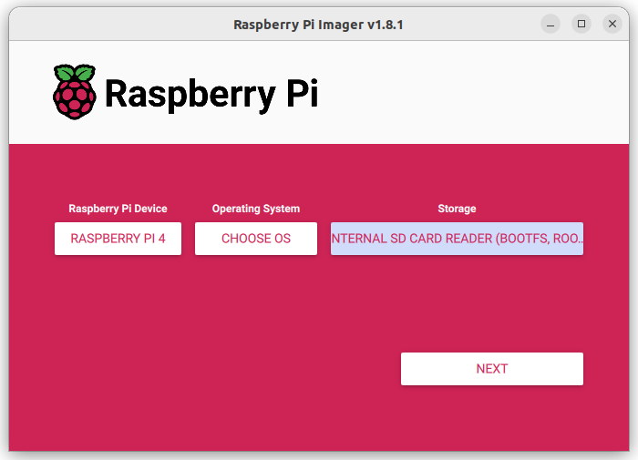
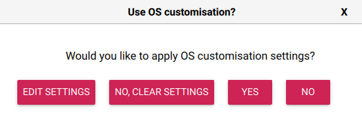
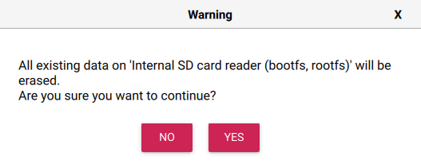
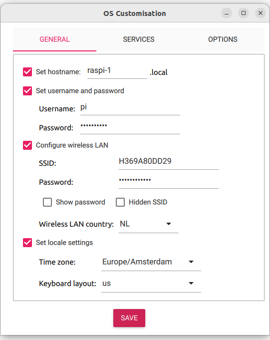
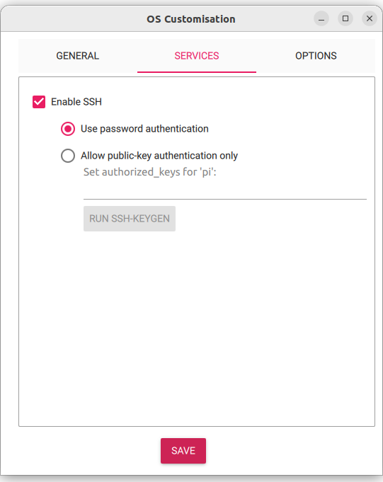

# Micro SD-kaartje klaarmaken voor de Raspberry Pi 4B.

*We gaan een Micro SD-kaartje klaarmaken voor de Raspberry Pi 4B met het besturingssysteem Raspberry Pi erop. Dit betekent dat we een speciaal soort computerprogramma op het kaartje gaan installeren. Ubuntu Server is gemaakt om te helpen bij het uitvoeren van taken op een computer.*

### Inhoud.

```@contents
Pages = ["chapter1.md"]
```

## Wat je nodig hebt.

Om een Micro SD kaartje te maken voor een Raspberry Pi 4B, heb je het volgende nodig:

- Een computer met een slot voor een Micro SD kaarthouder.
- Een [Micro SD](https://elektronicavoorjou.nl/product/transcend-micro-sd-rpi-os/) kaartje, bijvoorbeeld een van 64GB.
- Een Micro SD-kaarthouder, meestal wordt deze meegeleverd met het Micro SD kaartje.
- Het Raspberry Pi Imager programma.
- Naam van je Wifi-netwerk.
- Wachtwoord van je Wifi-netwerk.

## Wat je gaat doen.

Om Raspberry Pi Lite (64 bit) te installeren op je Raspberry Pi 4B, volg je deze stappen:

Stap 1: Installeer het Raspberry Pi Imager programma op je computer.

Stap 2: Maak het Micro SD kaartje klaar met Raspberry Pi Lite (64 bit).

Stap 3: Log in op Raspberry Pi.

Stap 4: Werk de Raspberry Pi bij.

## Stap 1 - Installeer het Raspberry Pi Imager programma op je computer.

|Stap        | Actie      |
|:---------- | :---------- |
| 1 | Ga naar [https://www.raspberrypi.com/software/](https://www.raspberrypi.com/software/) en download het programma Imager. |
| 2 | Installeer het programma. |
||

## Stap 2 - Maak het Micro SD kaartje klaar met Raspberry Pi Lite (64 bit).

|Stap        | Actie      |
|:---------- | :---------- |
| 1 | Doe het Micro SD-kaartje in de kaarthouder. |
| 3 | Doe de kaarthouder in je laptop. |
| 4 | Start het programma Imager. ``\\`` |
| 5 | Druk op de eerste knop **Raspberry Pi device** en kies Raspberry Pi 4|
| 6 | Druk op de tweede knop **Operating System** en kies: Raspberry Pi OS Lite (64-bit) |
| 7 | Druk op de derde knop **Storage** en kies Internal SD card Reader (bootfs, rootfs) |
| 8 | We gaan naar een plek waar we kunnen veranderen hoe onze computer werkt. Daar kunnen we bijvoorbeeld WiFi instellen, de naam van onze computer veranderen en een wachtwoord instellen zodat we vanaf een andere plek op onze computer kunnen werken. ``\\`` |
| 9 | Druk op de knop **NEXT** (rechts onderin) en kies voor YES. ``\\`` erin. |
| 10 | Je krijgt een waarschuwing dat je alles kwijt raakt. Druk op de toets **YES**. ``\\`` |
| 11 | Vul je wachtwoord van je PC in en klik op **Authenticate**. ``\\`` |
| 12 | Klik op het keuzevakje dat voor 'Set hostname' en verander de naam in 'raspi-1'. In stap 23 kun je ook zien wat je zou moeten invullen. |
| 13 | Klik op het keuzevakje dat voor 'Set username and password' staat. |
| 14 | Verander de naam in: `pi`. |
| 15 | En geef een wachtwoord op. Noteer het wachtwoord op een papiertje voor het geval je het vergeet. |
| 16 | Klik op het keuze vakje 'Configure wireless LAN' |
| 17 | Vul de gegevens van je Wifi in en geef als 'wireless LAN country op': NL. |
| 18 | Klik op het keuzevakje 'Show password' en controleer of het juist is. |
| 19 | Klik op het keuze vakje 'Set locale settings'. |
| 20 | Geef als 'Time zone' op: Europe/Amsterdam. |
| 21 | Geef je 'Keyboard layout' op, bijvoorbeeld us. Dit is het USB toetsenbord dat je eventueel aansluit op je Raspberry Pi. Het dialoogvenster ziet er als volgt uit: ``\\`` |
| 24 | Klik bovenin het dialoogvenster op **SERVICE**. Hier vermeld dat je de Raspberry pi vanuit een andere computer wilt benaderen. Vul het in volgens het volgende plaatje: ``\\`` |
| 25 | Druk op de **SAVE** toets om de gegevens te bewaren. 
| 26 | Haal de kaarthouder met de Micro SD kaart uit je computer. |
| 27 | Stop het SD kaartje in je Raspberry Pi en sluit de USB-C voeding aan. |
||

!!! info "Belangrijke veranderingen in het Imager programma"
   
    Vroeger moest je als je iets fout had ingevuld op je kaartje, zoals het wachtwoord voor WiFi, alles opnieuw doen. Maar nu kun je dat later veranderen. In stap 11 kies je dan voor **EDIT SETTINGS*. 
    
## Stap 3 - Log in op Raspberry Pi.

|Stap        | Actie      |
|:---------- | :---------- |
| 1 | Open een terminal venster. |
| 2 | Tik: `ping raspi-1` en noteer het IP-adres, bijvoorbeeld: 192.168.2.15 ``\\`` |
| 3 | Tik: `ssh pi@<IP-adres Raspberry Pi>`. |
| 4 | Tik: `yes`. |
| 5 | Druk op de Enter-toets. |
||


## Stap 4 - Werk de Raspberry Pi bij.

|Stap        | Actie      |
|:---------- | :---------- |
| 1 | Tik: `sudo apt update && sudo apt full-upgrade`. Het zijn twee Linux commando's die uitgevoerd worden: update en full-upgrade. `sudo` heb je nodig om voldoende rechten te krijgen om de commando's uitvoeren; er wordt om je wachtwoord van de Raspberry Pi gevraagd om te controleren of je het recht hebt de commando's uit te laten voeren. `apt` is de package manager, een programma waarmee je software pakketen kunt downloaden en updaten. Met `&&` koppel je de twee commando's. |
||

## Samenvatting.

Dit hoofdstuk gaat over het voorbereiden van een Micro SD-kaartje voor de Raspberry Pi 4B met het besturingssysteem Raspberry Pi OS Lite erop. Raspberry Pi OS Lite Server is gemaakt om te helpen bij het uitvoeren van taken op een computer. Om het kaartje klaar te maken, heb je een computer nodig met een Micro SD kaarthouder, een Micro SD kaartje van minimaal 32GB, en het Raspberry Pi Imager programma. Je hebt ook de naam en het wachtwoord van je wifi-netwerk nodig.

Om Raspberry Pi OS Lite Server te installeren, moet je het Raspberry Pi Imager programma op je computer installeren. Vervolgens moet je het Micro SD kaartje klaarmaken met Raspberry Pi OS Lite Server. Om dit te doen, moet je het kaartje in de kaarthouder schuiven en deze in je laptop plaatsen. Daarna moet je het Imager-programma starten en de stappen volgen om Raspberry Pi OS Lite Server op het kaartje te zetten.

Je moet ook enkele instellingen wijzigen om ervoor te zorgen dat Raspberry Pi OS LiteServer correct werkt. Dit omvat het veranderen van de naam van je computer naar 'raspi-1', het instellen van een wachtwoord en het configureren van je wifi-netwerk. Als je deze stappen hebt voltooid en Raspberry Pi OS Lite Server op het Micro SD kaartje is geïnstalleerd, haal je de kaarthouder uit je computer en ben je klaar om je Raspberry Pi 4B te gebruiken.