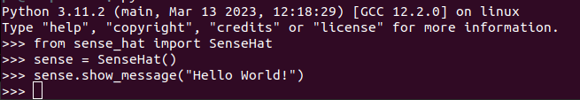

# Sense-HAT software installeren.

De Sense HAT is een geweldige uitbreiding voor de Raspberry Pi met een scala aan mogelijkheden. Enkele van de dingen die je ermee kunt doen zijn:

1. Sensordata verzamelen: De Sense HAT heeft sensoren voor temperatuur van de processor, luchtvochtigheid, luchtdruk, versnelling, en magnetisme. Je kunt deze gebruiken om data te verzamelen en te analyseren.

2. Display aansturen: Het LED-matrixdisplay op de Sense HAT kan worden geprogrammeerd om berichten, animaties, of sensordata weer te geven.

3. Spelletjes maken: Door de LED-matrix te gebruiken kun je eenvoudige spellen maken, zoals Snake of een reactiespel.

4. Experimenten met sensoren: Je kunt verschillende experimenten opzetten om te leren hoe sensoren werken, zoals het meten van temperatuurveranderingen of het detecteren van beweging.


### Inhoud.

```@contents
Pages = ["chapter3.md"]
```

## Wat je nodig hebt.

- Een Raspberry Pi 4B met het besturingssysteem Raspberry Pi Lite. 
- Een Sense-HAT ingepluged op de Raspberry Pi.
- SSH verbinding met de Raspberry Pi.

## Wat je gaat doen.

Stap 1: Software installeren.

Stap 2: Software testen.


## Stap 1 - Software installeren.

Om de sense-HAT te kunnen gebruiken zult je eerst de software ervoor moeten installeren

|Stap        | Actie      |
|:---------- | :---------- |
| 1 | Maak verbinding met je Raspberry Pi-computer door dit commando te typen: `ssh pi@IP_adres_Raspberry_pi`. Je moet het internetadres van je Raspberry Pi weten, dus kijk in [stap 2 van het vorige hoofdstuk](../chapter1/index.html#Stap-3-Log-in-op-Raspberry-Pi)|
| 2 | Update de software lijst van je Raspberry Pi door `sudo up apt update` in te tkken. Deze stap is altijd noodzakelijk als je nieuwe software wilt installeren. |
| 3 | Werk eventueel de software bij door `sudo apt full-upgrade`in te tikken. Deze stap is niet echt noodzakelijk en kan de nodige tijd kosten. je moet wel geduld hebben. |
| 4 | Typ: `sudo apt-get install sense-hat` om de software voor de sense-HAT te installeren. |
| 5 | Typ: `sudo apt autoremove` om oude troep te verwijderen. |
| 6 | Typ: `sudo reboot`. Hiermeer start je de computer opnieuw en wordt de nieuwe software actief. |
|| 


!!! info
    "sudo apt update && sudo apt full-upgrade" is eigenlijk een combinatie van twee commando's die je kunt gebruiken op een computer die Linux gebruikt, zoals de Raspberry Pi.

    Het eerste commando, "sudo apt update", zorgt ervoor dat de computer kan controleren of er nieuwe programma's beschikbaar zijn om te downloaden en te gebruiken. Het is alsof je jouw speelgoeddoos up-to-date houdt met nieuwe speeltjes.

    Het tweede commando, "sudo apt full-upgrade", is als het upgraden van je speelgoed. Het zorgt ervoor dat alle programma's die je hebt gedownload worden bijgewerkt naar de nieuwste versies.

    Dus, door het uitvoeren van deze twee commando's samen, kun je ervoor zorgen dat je altijd toegang hebt tot de nieuwste en beste programma's die beschikbaar zijn, en dat deze programma's ook worden bijgewerkt naar de nieuwste versies. Het is als het hebben van een bijgewerkte speelgoeddoos met de nieuwste en beste speeltjes die je kunt gebruiken om te spelen en te leren!

## Stap 2 - Software testen.

We willen het programma testen. Daarvoor hebben we het programma Python nodig, dat al voor je geinstalleerd is:

|Stap        | Actie      |
|:---------- | :---------- |
| 1 | Maak verbinding met je Raspberry Pi-computer door dit commando te typen: `ssh pi@IP_adres_Raspberry_pi`. Je moet het internetadres van je Raspberry Pi weten, kijk in hoofdstuk 1 onder [Stap 3 - Log in op Raspberry Pi.](../chapter1/index.html#Stap-3-Log-in-op-Raspberry-Pi.) om te zien hoe je het IP-adres kunt vinden. |
| 2 | Start Python op door te typen: `python`. Je kan zien dat je met versie 3.11.2 of hoger werkt.``\\`` | 
| 3 | Typ: `from sense_hat import SenseHat`. Sluit af door op de Enter-toets te drukken. |
| 4 | Typ: `sense = SenseHat()` en sluit af met <Enter>. |
| 5 | Typ: `sense.show_message('Hello World!')` en sluit af met <Enter>. Je hebt de volgende regels op je scherm staan: ``\\`` |
| 6 | En... misschien zag je ook de tekst "Hello World!" over het LED-display van de Sense-HAT scrollen. |
| 7 | Gebruik: Ctrl-D om Python te verlaten. |
| 8 | Gebruik: Ctrl-D om de Raspberry Pi te verlaten. |
||

De Sense-HAT werkt op je Raspberry Pi 4B met Raspberry Pi Lite.

!!! info
    Zowel in WSL (Windows 10 Subsystem for Linux), Linux, Python en de Mac kun je vorige commando's terug halen door op de toets met de pijl omhoog te drukken. Door op de Enter-toets te drukken wordt het commando opnieuw uitgevoerd.

### Windows.

Windows Subsystem for Linux (WSL) is een tool waarmee je Linux-programma's op je Windows-computer kunt gebruiken. Je hebt Windows 10 of hoger nodig om met WSL te gebruiken. Met de WSL kun je heel gemakkelijk het Linux commando `ssh` gebruiken. 

```
# Open een WSL venster.
# Typ: ssh pi@IP_adres_Raspberry_Pi. 
# Er wordt de eerste keer gevraagd of je verder wilt gaan, typ: yes. En druk daarna op de Enter-toets. 
# Daarna wordt er gevraagd om het wachtwoord van de Raspberry Pi.
```

!!! info
    In Windows 10 kun je een [(WSL - Windows Subsystem for Linux)](https://www.pcactive.nl/update/7265-wsl-linux-in-windows) venster openen door de volgende stappen te volgen:

    1.  Klik op de startknop in de taakbalk of druk op de Windows toets op je toetsenbord.
    2.  Zoek naar "Windows PowerShell" en klik erop om het te openen.
    3.  Typ in het PowerShell venster het volgende commando en druk op Enter:

    ```
    wsl
    ```
    
    Dit zal een WSL-venster openen waarmee je toegang hebt tot de Linux commandoregel.

### Mac.

Mac OS is een soort software die je computer laat werken, net zoals Linux. Er zijn veel dingen die hetzelfde zijn tussen Mac OS en Linux. Dit betekent dat je veel van dezelfde opdrachten kunt geven op een Mac als op Linux. Maar er zijn ook dingen die anders zijn tussen Mac OS en Linux, dus sommige opdrachten die je op een Linux computer kunt geven, werken niet op een Mac.

```
# Open een terminal sessie met Ctrl + Alt + T.
# Typ: ssh pi@IP_adres_Raspberry_Pi.
# de eerste keer gevraagd of je verder wilt gaan, typ: yes. En druk daarna op de Enter-toets. 
# Daarna wordt er gevraagd om het wachtwoord van de Raspberry Pi.

```

### Chromebook.

```
# Start een Linux container op door in de menubalk op het zwarte rondje met een groen >-teken te klikken.
# Kies: penquin.
# Typ: ssh pi@IP_adres_Raspberry_Pi.
# De eerste keer gevraagd of je verder wilt gaan, typ: yes. En druk daarna op de Enter-toets.
# Daarna wordt er gevraagd om het wachtwoord van de Raspberry Pi.

```

## Samenvatting.

De Sense-HAT is een geweldige toevoeging voor de Raspberry Pi die veel coole dingen kan doen! Je kunt sensoren gebruiken om gegevens zoals temperatuur en luchtdruk te meten, het LED-matrixdisplay programmeren om berichten weer te geven, en zelfs eenvoudige spellen maken zoals Snake. Om de Sense-HAT te gebruiken, moet je eerst de software ervoor installeren op je Raspberry Pi. Hiervoor maak je verbinding met je Raspberry Pi via een andere computer en installeer je de software met een paar eenvoudige commando's. Nadat de software is geïnstalleerd, kun je testen of alles werkt door Python op te starten en een eenvoudig bericht naar het LED-display van de Sense-HAT te sturen. Als alles goed gaat, ben je klaar om te experimenteren en te spelen met je Sense-HAT op de Raspberry Pi!