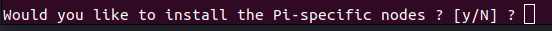
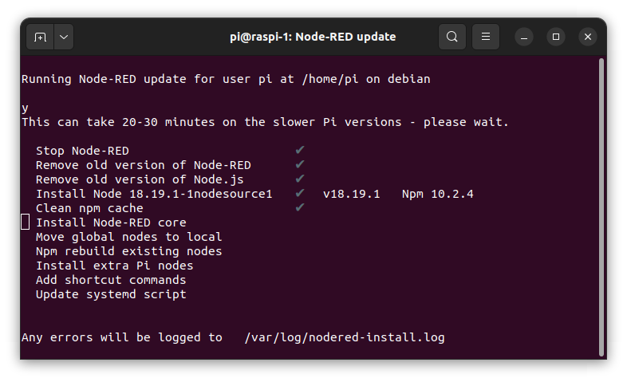
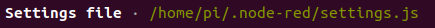
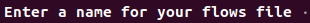
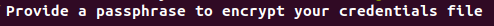
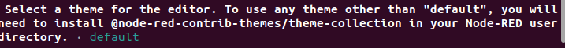
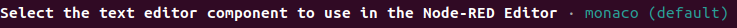
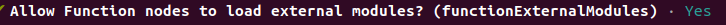

# Node-RED installeren.

*In deze les gaan we leren hoe je Node-RED installeert op een Raspberry Pi.*

### Inhoud.

```@contents
Pages = ["chapter4.md"]
```

## Wat je nodig hebt.

- Een Raspberry Pi 4B met het besturingssysteem Raspberry Pi Lite.
- Een Sense-HAT ingepluged op de Raspberry Pi.
- Een SSH verbinding met de Raspberry Pi vanuit je laptop.

## Wat je gaat doen.

Je gaat Node-RED installeren op de Raspberry Pi 4B.

Stap 1: Node-RED installeren.

Stap 2: Node-RED automatisch starten als de Raspberry Pi wordt aangezet.


## Stap 1: Node-RED installeren.

Het commando om Node-RED te installeren is: `bash <(curl -sL https://raw.githubusercontent.com/node-red/linux-installers/master/deb/update-nodejs-and-nodered)`

|Stap        | Actie      |
|:---------- | :---------- |
| 1 | Typ: `bash <(curl -sL https://raw.githubusercontent.com/node-red/linux-installers/master/deb/update-nodejs-and-nodered)` |
| 2 | Bevestig met: `y`. |
| 3 | Typ: `y`. ``\\`` |
| 4 | Wacht totdat alle programma's geinstallerd zijn. ``\\`` |
| 5 | Druk op Enter. ``\\`` |
| 6 | Kies `No`. ``\\`` |
| 7 | Kies `No`. ``\\`` |
| 8 | Druk op Enter. ``\\`` |
| 9 | Druk op Enter. ``\\`` |
| 10 | Druk op Enter. ``\\`` |
| 11 | Druk op Enter. ``\\`` |
| 12 | Kies `Yes`. ``\\`` |
| 13 | Typ: `sudo reboot`.
||

Zie ook het document [Running on Raspberry Pi](https://nodered.org/docs/getting-started/raspberrypi).

## Stap 2: Node-RED automatisch starten als de Raspberry Pi wordt aangezet.

Als je klaar bent met het installeren van Node-RED, kun je het starten door `node-red` in te typen. Maar om het nog makkelijker te maken, kun je instellen dat Node-RED automatisch begint te draaien wanneer je de Raspberry Pi aanzet.

Hiervoor hoef je alleen maar het commando `sudo systemctl enable nodered.service` te gebruiken.

## Samenvatting.

Gebruik het commando **bash <(curl -sL https://raw.githubusercontent.com/node-red/linux-installers/master/deb/update-nodejs-and-nodered)** om Node-RED te installeren.

Nadat Node-RED is geïnstalleerd, typ je node-red om het te starten. Maar als je het nog makkelijker wilt maken, kun je instellen dat Node-RED automatisch begint te werken wanneer je de Raspberry Pi aanzet. Typ hiervoor **sudo systemctl enable nodered.service**.