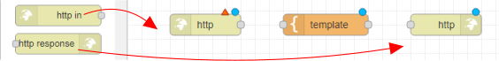
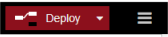

# Je eerste applicatie: een website opzetten

*We gaan een website maken met Node-RED. De website werkt alleen op het wifi-netwerk waar we op zijn aangesloten. Dit betekent dat we de website alleen kunnen bekijken als we met onze computer of telefoon verbonden zijn met het wifi-netwerk. Tijdens het maken van de website leer je ook werken met HTML-code. HTML is een soort taal waarmee we websites kunnen maken.*

### Inhoud

```@contents
Pages = ["chapter5.md"]
```

## Wat je nodig hebt

- Een Raspberry Pi 3B+ met het besturingssysteem Ubuntu Server 22.04.
- Docker, Portainer en Node-RED zijn geinstalleerd.

## Wat je gaat doen

Stap 1: Introductie tot Node-RED en een "Hallo wereld!" voorbeeld.

Stap 2: Personaliseer je website.

## Stap 1: Introductie tot Node-RED en een "Hallo wereld!" voorbeeld

Je hebt 3 knooppunten nodig om een eenvoudige website te maken:
- http in
- template (staat in functie, 1 sectie hoger)
- http response

Met "http in" vertel je hoe mensen naar een specifieke pagina op je website kunnen gaan. De pagina is te vinden op het adres IP_adres_raspberry_pi:1880/naam\_pagina. "http response" zorgt ervoor dat de pagina er mooi uitziet door middel van iets watHTML-code heet. In "template" kun je zien hoe de HTML-code eruit ziet.

**Voer de volgende stappen uit:**

1. Ga met je browser naar `IP_adres_raspberry_pi:1880`.
2. Sleep de knooppunten naar je werkblad. Zie ook [Inleiding NodeRed](https://eelcodijkstra.github.io/iot-0/html/inleiding/nodered-inleiding.html) van Eelco Dijkstra.
    
   

3. Verbind de knooppunten met de muis aan elkaar. Steeds een eindpunt met een beginpunt. Als je alle knooppunten aan elkaar hebt geplakt, heb je een "Flow". Dit is een soort programma.
4. Dubbelklik op het `http in` knooppunt en geef als URL op: `/hallo`.
5. Dubbelklik op template en tik `<h1>Hallo wereld!</h1>` op de eerste regel van het veld "template".
   
   
   
6. Klik op de knop "Deploy" boven aan rechts om de code te maken voor je website.

   
   
7. Typ in de zoekbalk van je internet browser: `IP_adres_Raspberry_Pi:1880/hallo`. Als alles goed is gegaan, zie je 'Hallo wereld!' in vette letters verschijnen op het scherm. Ik heb in het voorbeeld hieronder nog wat extra tekst toegevoegd die ik zet tussen de <p>...</p> tags het gezet.
    
   

8. Voeg meer tekst toe aan de website door ze tussen de `<p>` en `</p>` tags te zetten.


## Stap 2: Personaliseer je website

Web responsive design (WRD) betekent dat je website op elk apparaat, zoals je computer, tablet of telefoon, er altijd even mooi uitziet en makkelijk te gebruiken is. Het past zichzelf aan de grootte van het scherm aan, zodat je altijd een fijne ervaring hebt, ongeacht op welk apparaat je het bekijkt. [Bootstrap](https://www.w3schools.com/bootstrap/bootstrap_ver.asp) helpt ontwikkelaars hierbij.

1. Ga met je browser naar Node-RED: `IP_adres_raspberry_pi:1880`.

2. Vervang de code in het knooppunt `template` met de volgende code:

   ```
   <!DOCTYPE html>
   <html>
     <head>
       <title>Bootstrap Example</title>
       <meta charset="utf-8">
       <meta name="viewport" content="width=device-width, initial-scale=1">
       <link rel="stylesheet" href="https://maxcdn.bootstrapcdn.com/bootstrap/3.4.1/css/bootstrap.min.css">
       <script src="https://ajax.googleapis.com/ajax/libs/jquery/3.6.1/jquery.min.js"></script>
       <script src="https://maxcdn.bootstrapcdn.com/bootstrap/3.4.1/js/bootstrap.min.js"></script>
     </head>
     <body>
      
       <div class="container">
         <h1>Hallo Wereld!</h1>
         <p>Een website maak je met HTML-tags. Een tag staat tussen een kleiner (<) en een gtoter (>) teken.</p>
         <p>Een HTML-tag wordt afgesloten met dezelfde naam voorafgegaan door het slash (/) teken.</p>
         <p>Voor de kopteksten gebruik je de tags h1 tot en met h6.</p>
         <p>Gewone tekst zet je tussen de p-tags.</p>
         <p>Veel plezier met het maken van je website. Rob.</p>
                    
       </div>
     
     </body>
   </html>
   ```
   Dit is een stuk code in het HTML formaat. Het bevat instructies voor een website om weer te geven op internet.
   
   De eerste regel <!DOCTYPE html> zegt de browser welk soort code de website bevat.
   
   De volgende regel <html> markeert het begin van de HTML-code.
   
   Daarna hebben we de <head> en <body> secties. In de <head> sectie staat informatie over de website, zoals de titel van de website en de bronnen voor stijlen en scripts.
   
   In de <body> sectie staat de inhoud van de website die we willen weergeven aan de gebruiker.
   
   De code maakt gebruik van Bootstrap, een toolkit voor het maken van mooie en responsieve websites.

3. Test de website op je computer door het venster van de browser smaller te maken: `IP_adres_raspberry_pi:1880/hallo`.

!!! info
    Een vast IP-adres op wifi is zoals een huisadres voor je apparaat. Het is uniek en zorgt ervoor dat je apparaat altijd hetzelfde adres heeft wanneer het aan het wifi-netwerk is verbonden. Dit maakt het makkelijker voor andere apparaten om contact met jouw apparaat te maken.

    Om een vast IP-adres te krijgen, moet je naar de instellingen van je wifi-router gaan. Daar moet je de instellingen van je apparaat veranderen zodat het altijd hetzelfde IP-adres krijgt wanneer het aan het wifi-netwerk is verbonden. Als je niet weet hoe dat moet, vraag het dan aan iemand die daar verstand van heeft.

## Samenvatting

Dit hoofdstuk gaat over het bouwen van een website met Node-RED. Node-RED is een programma waarmee je websites kunt maken en leren hoe HTML-code werkt. De website werkt alleen op het wifi-netwerk waarmee je verbonden bent. Je hebt een Raspberry Pi 4B nodig met het besturingssysteem Raspberry Pi Lite en Node-RED geïnstalleerd. Om een eenvoudige website te maken met Node-RED heb je 3 knooppunten nodig, namelijk "http in", "template" en "http response". Met deze knooppunten maak je een flow die als een soort programma werkt.


