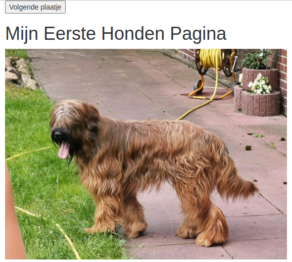
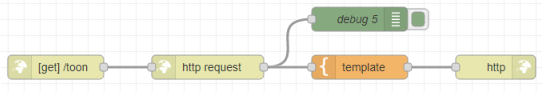

# Je tweede applicatie: Plaatjes van Honden tonen.

*In deze les maak je gebruik van een website die via een API te benaderen is.*



### Inhoud.

```@contents
Pages = ["chapter6.md"]
```

## Wat je nodig hebt.

- Een Raspberry Pi 4B met het besturingssysteem Rasberry Pi Lite.
- Een SSH verbinding met de Raspberry Pi.

## Wat je gaat doen.

Stap 1: Wat is een API.

Stap 2: Website personaliseren.

Stap 3: Anderen van je website laten genieten.

## Stap 1: Wat is een API.

Een API (Application Programming Interface) is een manier voor computers om met elkaar te praten en informatie uit te wisselen. Ze doen dit door verzoeken en antwoorden uit te wisselen. JSON is een manier om informatie op te slaan en uit te wisselen die zowel door computers als door mensen begrepen wordt. Als Nederlander spreek je "API" uit als "ee-pie-ai".

Zo is er de website [Dogs](https://dog.ceo/api/breeds/image/random) die steeds de URL van een ander plaatje van een hond geeft in JSON formaat:

```
{
  "status":"success",
  "message":"https://images.dog.ceo/breeds/segugio-italian/n02090722_002.jpg"
}
```

De code bevat twee delen: een sleutel en een waarde gescheiden door een dubbele punt (:). De sleutel staat aan de linkerkant en de waarde staat aan de rechterkant.

De eerste sleutel is "status" en de waarde is "success". Dit betekent dat alles goed is gegaan en er geen fouten zijn opgetreden.

De tweede sleutel is "message" en de waarde is een URL "https://images.dog.ceo/breeds/segugio-italian/n02090722_002.jpg". Dit is een link naar een afbeelding op het internet.

Dus dit stuk code bevat informatie over de status van een bepaalde actie en een link naar een afbeelding.

**Voer de volgende stappen uit:**

1. Ga met je browser naar `IP_adres_raspberry_pi:1880`. Zie in de infobox ["Let op"](../index.html) van de inleiding hoe je het moet doen.

2. Sleep de volgende knooppunten naar je werkblad:
   - `http in`
   - `http request`
   - `template`
   - `http response`
   - `debug`

   Een `http request` gebruik je als je op internet iets vraagt aan een website, zoals de honden website. Het antwoord dat je terugkrijgt is in het formaat van "JSON". Als je "debug" gebruikt, kun je het antwoord dat je hebt opgehaald bekijken.

3. Verbind de knooppunten net als op de tekening:
   
   

4. Voer de volgende webadres in bij het invoerveld 'http in': `/toon`.

5. Geef in het webadres voor een foto van een hond op: `https://dog.ceo/api/breeds/image/random`. 

6. Stel "**<-**Return" in op "a parsed JSON object".

7. Je krijgt een plaatje van een willekeurige hond te zien met de HTML code: ``.

   Deze code moet je gebruiken om [echte websites](https://www.w3schools.com/html/html_intro.asp) te maken.

   Plaats in het `template` de HTML-code voor de website:

   ```
   <!DOCTYPE html>
   <html>
   <head>

     <title>Dogs</title>

   </head>
   <body>

     

   </body>
   </html>
   ```
   In de `<head>` sectie kun je de titel van je website zetten. In de `<body>` sectie kun je de HTML voor de website zetten.
   
   Klik [hier voor een lijst met API's](https://mixedanalytics.com/blog/list-actually-free-open-no-auth-needed-apis/).

8. Test het resultaat in de browser: `IP_adres_raspberry_pi:1880/toon`.

9. Als je de link ververst zie je steeds een andere hond.

## Stap 2: Website personaliseren.

Web Responsive Design (WRD) betekent dat je website op elk apparaat, zoals je computer, tablet of telefoon, er altijd even mooi uitziet en makkelijk te gebruiken is. Het past zichzelf aan de grootte van het scherm aan, zodat je altijd een fijne ervaring hebt, ongeacht op welk apparaat je het bekijkt. [Bootstrap](https://www.w3schools.com/bootstrap/bootstrap_ver.asp) helpt ontwikkelaars hierbij.

1. Ga met je browser naar Node-RED: `IP_adres_raspberry_pi:1880`.

2. Vervang de code in het knooppunt `template` met:

   ```
   <!DOCTYPE html>
   <html>
     <head>
       <title>Bootstrap Example</title>
       <meta charset="utf-8">
       <meta name="viewport" content="width=device-width, initial-scale=1">
       <link rel="stylesheet" href="https://maxcdn.bootstrapcdn.com/bootstrap/3.4.1/css/bootstrap.min.css">
       <script src="https://ajax.googleapis.com/ajax/libs/jquery/3.6.1/jquery.min.js"></script>
       <script src="https://maxcdn.bootstrapcdn.com/bootstrap/3.4.1/js/bootstrap.min.js"></script>
     </head>
     <body>
      
       <div class="container">
         <button onclick="location.reload();">Volgende plaatje</button>
         <h1 style="text-align:center;">Mijn Eerste Honden Pagina</h1>
                    
       </div>
     
     </body>
   </html>
   ```
   Dit is een stuk code in het HTML formaat. Het bevat instructies voor een website om weer te geven op internet.
   
   De eerste regel <!DOCTYPE html> zegt de browser welk soort code de website bevat.
   
   De volgende regel <html> markeert het begin van de HTML-code.
   
   Daarna hebben we de <head> en <body> secties. In de <head> sectie staat informatie over de website, zoals de titel van de website en de bronnen voor stijlen en scripts.
   
   In de <body> sectie staat de inhoud van de website die we willen weergeven aan de gebruiker. Bijvoorbeeld een knop om naar een volgend plaatje te gaan, een koptekst "Mijn Honden Pagina" en een plaatje van een hond.
   
   De code maakt gebruik van Bootstrap, een toolkit voor het maken van mooie en responsieve websites.

3. Test de website op je computer door het venster van de browser smaller te maken: `IP_adres_raspberry_pi:1880/toon`.
   
   

!!! info
    Een vast IP-adres op wifi is zoals een huisadres voor je apparaat. Het is uniek en zorgt ervoor dat je apparaat altijd hetzelfde adres heeft wanneer het aan het wifi-netwerk is verbonden. Dit maakt het makkelijker voor andere apparaten om contact met jouw apparaat te maken.

    Om een vast IP-adres te krijgen, moet je naar de instellingen van je wifi-router gaan. Daar moet je de instellingen van je apparaat veranderen zodat het altijd hetzelfde IP-adres krijgt wanneer het aan het wifi-netwerk is verbonden. Als je niet weet hoe dat moet, vraag het dan aan iemand die daar verstand van heeft.

## Stap 3: Anderen van je website laten genieten.

Aan het eind van de les zul je je applicatie aan je medestudenten moeten laten zien. Dat is zonder meer mogelijk omdat ze allemaal een computer hebben die aangesloten is op hetzelfde WiFi netwerk.

Sommigen zullen het misschien ook op hun Smartphone willen bekijken. Vraag aan je docent wat de naam van het netwerk is en wat de inlogcode is.

## Samenvatting.

Deze les gaat over het maken van een speciale app. We willen plaatjes van honden laten zien! We gebruiken een speciale website om deze plaatjes te krijgen.

Eerst leren we over iets dat een "API" heet. Dat is een manier voor computers om met elkaar te praten en informatie te delen. We krijgen de plaatjes van honden via zo'n API, en de informatie komt in een speciaal formaat genaamd "JSON".

Daarna leren we hoe we een website maken. We gebruiken een Raspberry Pi-computer en schrijven wat code om de plaatjes te laten zien. Ook leren we hoe we de website mooi kunnen maken, zodat hij er goed uitziet op verschillende apparaten.

Uiteindelijk, als onze website klaar is, kunnen we het aan anderen laten zien. Misschien willen onze vrienden het op hun computer of smartphone bekijken. We moeten dan wel weten hoe we verbinding kunnen maken met hetzelfde Wi-Fi-netwerk als zij. Dat vragen we aan de leraar.

Dat is in het kort waar deze les over gaat! We leren hoe we plaatjes van honden kunnen laten zien op onze zelfgemaakte website, en hoe we die met anderen kunnen delen.