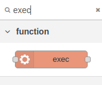

# Je derde applicatie: Vuurpijl afschieten".

*ChatGPT kan Python code voor je genereren. We laten zien hoe je een vuurpijl simuleert op de Sense-HAT.*

### Inhoud.

```@contents
Pages = ["chapter7.md"]
```

## Wat je nodig hebt.

- Een Raspberry Pi 34 met het besturingssysteem Rasberry Pi.
- Een Sense-HAT ingepluged op de Raspberry Pi.
- SSH verbinding met de Raspberry Pi.

## Wat je gaat doen.

Stap 1: ChatGPT Python software laten genereren.

Stap 2: Vervang de Python code door die van de docent.

Stap 3: Python code vanuit Node-RED aanroepen.

## Stap 1: ChatGPT Python software laten genereren.

ChatGPT is een genertief AI (Artificial Intelligent = Kunstmatige Intelligentie) programma dat ook computer software kan genereren. Zie ook de inleiding, waar [ChatGPT](../index.html#Wat-is-ChatGPT?) zelf uitlegt wat het kan doen voor jou.

Het blijkt dat het ook Python code voor de Sense-HAT genereren. Je moet wel geregistreerd staan bij OpenAI.com om met ChatGPT te mogen werken. Momenteel is versie 3.5 nog gratis. Dit is de versie die we in de cursus gaan gebruiken. Je werkt vanuit een webbrouwser.

|Stap        | Actie      |
|:---------- | :---------- |
| 1 | Open je browser. |
| 2 | Type: https://openai.com/ in de adresbalk. |
| 3 | Klik rechtsboven op de toets: Try ChatGPT. ``\\`` |
| 4 | Vermoedlijk wordt er gevraagd om in te loggen. Registreer jezelf eerst. Het makkelijkste is het als je al een Google account hebt. |
| 5 | Klik links boven op: New Chat. |
| 6 | Stel een vraag in het boxje onderaan in het midden, bijvoorbeeld: Wie heeft het programma Python ontwikkeld? |
| 7 | Vermoedelijk krijg je het volgende antwoord: Python is ontwikkeld door Guido van Rossum en werd voor het eerst uitgebracht in 1991. Van Rossum is een Nederlands informaticus die Python ontwikkelde als een opvolger van de programmeertaal ABC. Hij leidde het project gedurende vele jaren en had een grote invloed op de ontwikkeling van Python. |
| 8 | Experimnteer verder, vraag bijvoorbeeld: Wat kun je doen met de sense-hat? |
||

In principe begin je met een eenvoudige vraag, die je steeds verder uitwerkt, bijvoorbeeld:

v1: Schrijf de Python code voor een vuurpijl voor de sense-HAT.

Test vervolgens je code:
1. Open een terminal op je laptop en type: ssh pi@192.168.2.15. Gebruik bij de CoderDojo het wachtwoord: `r7P94%B&`.
2. Typ: `cd projects/python`.
3. Typ: `nano vuurpijl.py`.
4. Plak de code van ChatGPT in de editor met: Ctrl+Shift+V.
5. Bewaar het bestand met: Ctrl+O.
6. Verlaat de editor met: Ctrl+X.
7. Typ: `python vuurpijl.py`.
8. Stop de code met: Ctrl+C.

v2: Pas de code aan zodat de vuurpijl maar 1 keer wordt afgechoten.

Test de code nogmaals:
1. Typ: `nano vuurpijl.py`.
2. Wis alle regels met: Ctrl+K.
3. Plak de code van ChatGPT in de editor met: Ctrl+Shift+V.
4. Bewaar het bestand met: Ctrl+O.
5. Verlaat de editor met: Ctrl+X.
6. Typ: `python vuurpijl.py`.

v3. Pas de code aan zodat de explosie gedurende 15 seconden uit 30 willekeurige pixels bestaat.

Test de code nogmaals.

Enzovoort, totdat je tevreden bent.

## Stap 2: Python code vanuit Node-RED aanroepen.

Resultaat Python code docent, waar hij wel het nodige aan heeft moeten sleutelen:

```
from sense_hat import SenseHat
import time
import random

sense = SenseHat()

# Functie voor het weergeven van een vuurpijl op het LED-display met donkerblauwe achtergrond
def vuurpijl():
    sense.clear(0, 0, 50)  # Zet het hele display op donkerblauw als achtergrond

    # Loop om de vuurpijl te simuleren
    for i in range(8):
        # Toon de vuurpijl die omhoog schiet
        sense.set_pixel(3, 7 - i, (255, 255, 255))  # Witte lijn die omhoog gaat
        time.sleep(0.1)

    sense.clear(0, 0, 50)  # Wis het display voor de explosie

    # Simuleer explosie van de vuurpijl op een donkerblauwe achtergrond
    for _ in range(100):
        for _ in range(25):
            x = random.randint(0, 7)
            y = random.randint(0, 7)
            kleur = (random.randint(100, 255), random.randint(0, 255), random.randint(100, 255))  # Pas de kleuren aan naar wens

            sense.set_pixel(x, y, kleur)
        time.sleep(0.05)
        sense.clear(0, 0, 50)  # Wis het display voor de volgende stap

# Roep de vuurpijl functie aan
vuurpijl()
sense.clear(1, 1, 1)
```

###### Opdracht.

Vervang de Python code van vuurpijl.py door de code die staat aan het begin van deze paragraaf, [Stap 2](#Stap-2:-Python-code-vanuit-Node-RED-aanroepen.). Test de code.

###### Les 8.

In les 8 leer je hoe je de vuurpijl afschiet met behulp van de button-node (een toets waarop je kunt klikken die op je scherm staat van je bijvoorbeeld je smartphone) uit de Dashboard module.

## Stap 3 - Python code vanuit Node-RED aanroepen.

Het is natuurlijk handiger als je de code vanuit Node-RED zelf kan aanroepen.

|Stap        | Actie      |
|:---------- | :---------- |
| 1 |  Sleep daarop de volgende nodes naar je werkblad: timestamp, exec en debug naar je werkblad. Zoek naar de node `exec` met de zoek functie bovenin de linker kolom. Wis het zoeken door op het x te klikken.``\\`` |
| 2 | Verbind de nodes met elkaar. ``\\`` |


## Samenvatting.

