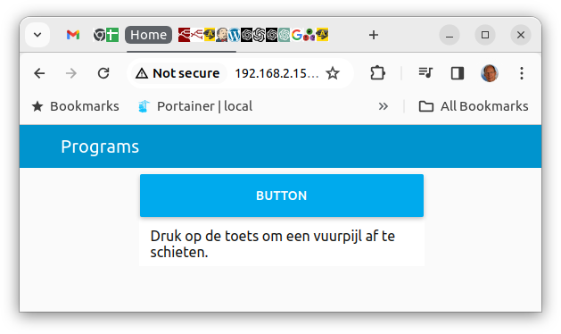
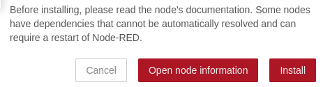
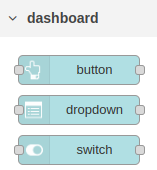
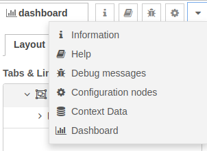
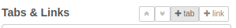
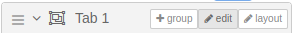
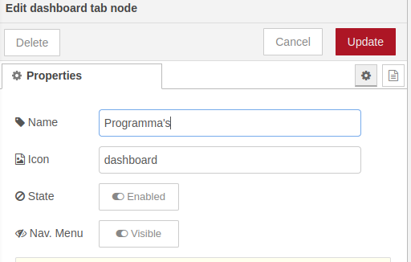
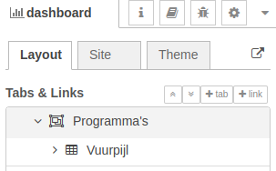
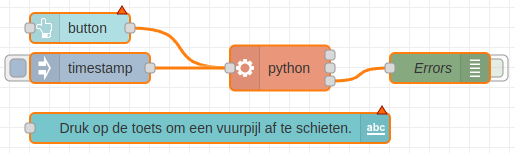
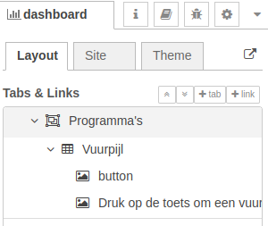

# Een Vuurpijl activeren vanuit je smartphone.

Deze module geeft je een set knooppunten in [Node-RED](https://flows.nodered.org/node/node-red-dashboard) waarmee je snel een live data dashboard kunt maken.

Je gaat een dashboard maken dat de volgende dingen laat zien:
- Een toets, die als je erop drukt de vuurpijl afschiet op de Sense-HAT.



```@raw html

```

### Inhoud

```@contents
Pages = ["chapter8.md"]
```

## Wat je nodig hebt

- Een Raspberry Pi 4B met het besturingssysteem Raspberry Pi Lite.
- Een Sense-HAT ingepluged op de Raspberry Pi.
- SSH verbinding met de Raspberry Pi.
- Les 7: Je derde applicatie: Vuurpijl afschieten".

## Wat je gaat doen

Stap 1: De Node-RED Dashboard module downloaden.

Stap 2: Indelen van een dashboard.

Stap 3: De dashboard nodes toevoegen.

## Stap 1 - De Node-RED Dashboard module downloaden.

Node-RED heeft al veel verschillende knooppunten om te gebruiken, maar soms wil je nog meer. Dan kun je nieuwe onderdelen toevoegen. Een handige toevoeging is de [dashboard](https://flows.nodered.org/node/node-red-dashboard) module. Deze module bestaat uit verschillende onderdelen die speciaal zijn gemaakt om een dashboard te maken. Bijvoorbeeld, er is een onderdeel om een toets en als je daar op drukt schieten we de vuurpijl af. Ook is er een onderdeel om gegevens als tekst weer te geven. Je moet de module wel zelf toevoegen, want het zit niet automatisch al in Node-RED.

|Stap        | Actie      |
|:---------- | :---------- |
| 1 | Als je naar "Manage Palette" wilt gaan, kun je op het menu klikken dat in de rechterbovenhoek van het scherm staat. Of je kunt de toetsen Shift + Alt + P indrukken. |
| 2 | Ga naar de "Install" tab en zoek naar `node-red-dashboard` in de zoekbalk.  ``\\``|
| 3 | Als je de dashboard onderdelen wilt krijgen, moet je op de witte knop met "Install" erop klikken.|
| 4 | Je ziet een berichtje op je scherm. Druk op de rode knop waar "Install" op staat om de dashboard onderdelen te krijgen. ``\\``   |
| 5 | Klik op de toets "Close". |
| 6 | Als je de dashboard onderdelen hebt geïnstalleerd, kun je ze vinden in het linkerkolom onder het kopje "dashboard". ``\\`` |
||

## Stap 2 - Indelen van een dashoard.

Een dashboard kan bestaan uit verschillende tabs. Een tab kan verschillende groepen hebben. Het is goed om hierover vooraf al een beeld te vormen.

Een gebruiker kan maar één tab actief hebben. Een tab kan bestaan uit verschillende groepen

Ons dashboard bestaat uit de tab Programma's met een groep Vuurpijl.


Opzetten van de structuur.

|Stap        | Actie      |
|:---------- | :---------- |
| 1 | Klik op pijltje naar beneden in het menu van de linkerkolom en kies voor Dashboard. ``\\`` |
| 2 | Klik op `+Tab` om er een te maken. Het krijgt de naam `Tab 1`. ``\\`` |
| 3 | Ga met je muis over de regel met `Tab 1` en klik vervolgens op de `Edit`-toets. ``\\`` |
| 4 | Geef als naam voor de tab op: Programma's. ``\\`` |
| 5 | Ga met je muis over de regel met `programma's` en klik op `group`. |
| 6 | Ga met je muis over de regel met `Group 1` en klik op de `Edit`-toets.
| 7 | Geef als naam op voor de groep: Vuurpijl.  Je hebt nu: ``\\`` |
||


## Stap 3 - De dashboard nodes toevoegen.

Als je het adres `IP_adres_raspberry_pi:1880/ui` intypt in je web browser, zul je de dashboard nodes zien die je toegevoegd heb aan je dashboard menu".

Volg deze stappen om het werk te doen:
 
|Stap        | Actie      |
|:---------- | :---------- |
| 1 | Gebruik de flow van opdracht 7 en sleep uit het dashboard overzicht de vogende twee nodes toe: button en text. ``\\`` |
| 2 | Verander de tekst van de text-node in: "Druk op de toets om een vuurpijl af te schieten." |
| 3 | Dubbelklik op de toets `button` en kies voor de groep `[Programma's] Vuurpijl`. ``\\`` |
| 4 | Klik op de toets `Done'. |
| 5 | Dubbelklik op de text-node en kies ook voor de groep `[Programma's] Vuurpijl`. ``\\``|
| 6 | Klik op de toets `Done'. |
| 7 | Klik op de Deploy-toets. |
| 8 | Ga in de browser naar <IP-adres Raspberry Pi>:1880/ui en druk op de Enter toets. ``\\`` |
||

## Samenvatting

In les 8 leren we hoe we een vuurpijl kunnen activeren vanaf onze smartphone met behulp van Node-RED. Node-RED is een programma waarmee we gemakkelijk een live data dashboard kunnen maken. We gaan een dashboard maken dat een knop bevat waarmee we de vuurpijl kunnen afschieten op de Sense-HAT.

Wat hebben we nodig? Een Raspberry Pi 4B met het besturingssysteem Raspberry Pi Lite, een Sense-HAT aangesloten op de Raspberry Pi en een SSH-verbinding met de Raspberry Pi.

Stap 1: We downloaden de Node-RED Dashboard module en installeren deze. Deze module bevat speciale onderdelen om een dashboard te maken.

Stap 2: We maken een nieuw tabblad in ons dashboard met de naam "Programma's" en een groep genaamd "Vuurpijl". Dit helpt ons om ons dashboard overzichtelijk te houden.

Stap 3: We voegen dashboard nodes toe, zoals een knop om de vuurpijl af te schieten en tekst om aan te geven wat er gaat gebeuren. Nadat we onze flow hebben ingezet, kunnen we ons dashboard bekijken in onze webbrowser.

Met deze stappen kunnen we een dashboard maken waarmee we vanaf onze smartphone een vuurpijl kunnen activeren op de Sense-HAT. Het is een leuke manier om te leren over programmeren en technologieën zoals de Raspberry Pi.